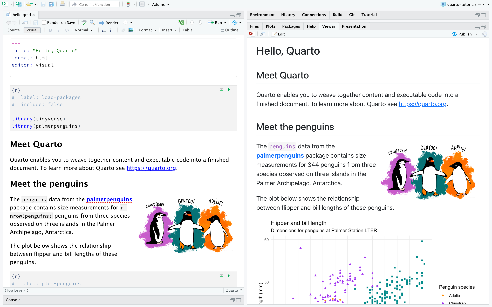

## Get ready

If you have not recently [downloaded R](https://cloud.r-project.org/), do so now.

If you have not recently [downloaded RStudio](https://posit.co/download/rstudio-desktop/), do so now.

# What is R?

## What is R?

**R** is a programming language designed originally for *statistical analyses*.

. . .

**R** was created by **Ross Ihaka** and **Robert Gentleman** in 1993.

_(Their names are why it's called **R**, which is also a joke about the predecessor
being called **S**.)_

. . .

**R** was formally released by the **R Core Group** in 1997.

[https://www.r-project.org/contributors.html](https://www.r-project.org/contributors.html)

This group of 20-ish volunteers are the *only* people who can change the **base** 
(built-in) functionality of **R**.

## Strengths

**R**'s **strengths** are...

. . .

... handling data with lots of **different types** of variables.

. . .

... making nice and complex data **visualizations**.

. . .

... having cutting-edge statistical **methods** available to users.

## Weaknesses

**R**'s **weaknesses** are...

. . .

... performing non-analysis programming tasks, like website creation. 

(*python*, *ruby*, ...)

. . .

... hyper-efficient numerical computation. 

(*matlab*, *C*, ...)

. . .

... being a simple tool for all audiences 

(*SPSS*, *STATA*, *JMP*, *minitab*, ...)

# But wait!

## Packages

The heart and soul of **R** is **packages**.

. . .

These are "extra" sets of code that add **new functionality** to R when installed.

. . .

"Official" **R** packages live on the *Comprehensive R Archive 
Network*, or **CRAN**

. . .

But anyone can write and share new code in "package form" 

## Open-Source

Importantly, **R** is *open-source*.

. . .

There is no company that owns **R**, like there is for *SAS* or *Matlab*.

(*Python* is also open-source!)

. . .

This means nobody can sell their **R** code!

. . .

* (but you can sell "helpers" like **RStudio**)

. . .

* (and you can keep code **private** within an organization or company)

. . .

**Packages are created by users like you and me!**

# Intro to RStudio

## What is RStudio?

**RStudio** is an IDE (*Integrated Developer Environment*).

This means it is an application that makes it easier for you to interact with **R**.

. . .

## History of RStudio

**RStudio** was released in 2011 by J.J. Allaire.

. . .

In 2014, RStudio hired *Hadley Wickham* as Chief Data Scientist.  
They now are called **Posit**, and they employ around 20 full-time R developers.

. . .

Recall: You can __not__ sell __R__ code; packages created by Posit's team are freely available.  

They make money off the IDE and other helper software.

## Brief tour of RStudio

# Intro to Quarto

## About Quarto

**Quarto** is a file type with the extension `.qmd` that lets you mix text and code.

. . .

Quarto documents have the ability to **render** to nicely formatted `pdf` or `html`

## Rendering

When you click **render**, here is what happens:

1. Your file is saved.

2. The R code written in your *.qmd* file gets run.

    + Any code you ran already doesn't "count"; we start from scratch.
    + The code is run *in order*.

3. A new file is created.

    + If your Quarto file is called `Data_Analysis.qmd`, then a file called `Data_Analysis.html` will be created in the same directory as the qmd.
 

## Let's try it!

1. Open **RStudio**.

2. In your **console**, run `install.packages("usethis")`

3. In your **console**, run `usethis::use_course("Docere-Data-Science/Intro-to-Tidyverse")`

4. Open the file in the `Activities` folder named `01-Setup.qmd`.